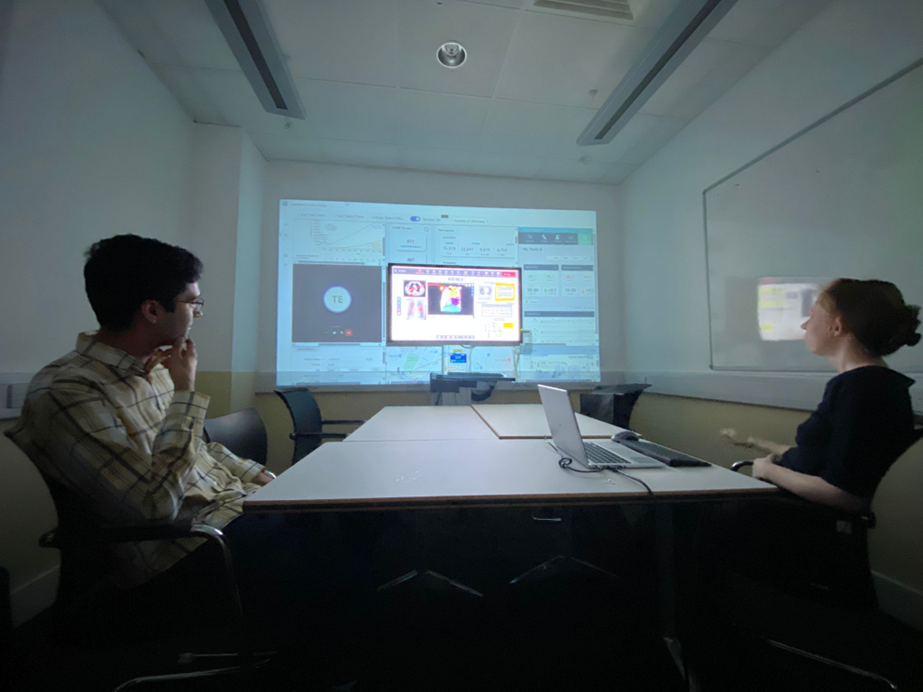
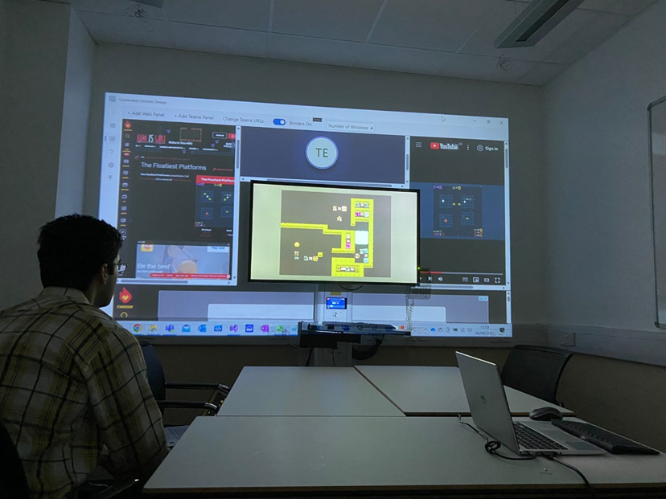
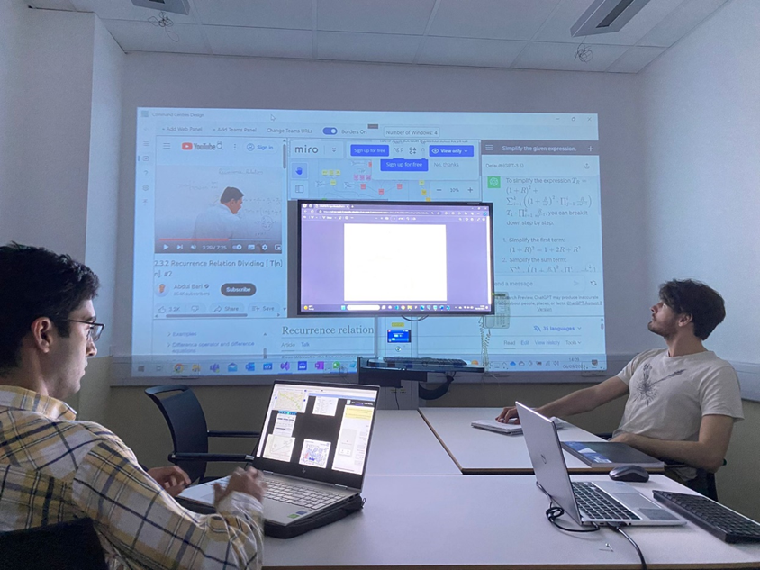

# Command-Centres-Design

## Table of Contents
- [Introduction](#introduction)
- [Features](#features)
- [Getting Started](#getting-started)
- [Usage](#usage)

## Introduction
The Illumiroom Command Centre represents a continuation of the Illumiroom line of projects, and hopes to provide a simple, highly configurable software solution to a largely hardware-dependent problem.

## Features
- **Configurable Panel Selection**
  - **Window Swapping:** Users can drag and drop windows within the configuration to change their location.
  - **Adding/Removing Windows:** Users can freely add and remove windows to and from the application.
- **Integrated Teams Web App**
  - **Start and Join Meetings:** Users may start and join Teams calls through the application, sending attendence invites and using chat functionality.
- **Layout Auto-Optimisation**
  - **Reconfigure on Window Change:** Panel placement and size automatically reconfigures to optimise available space utilisation.

## Getting Started
### Prerequisites
- Ensure you have the latest version of Visual Studio installed.

### Installation
1. Clone the repository: `git clone https://github.com/doctordeano/Command-Centres-Design.git`
2. Open the project in Visual Studio.
3. Build and Run the solution.

## Usage
### Display With Projection
1. Set up your projector so that it projects onto your screen and the wall behind it to your preferred layout.
2. Plug the projector into your laptop running the application through the HDMI port and select screen mirroring.
3. Calibrate the application so that the screen is unobscured by the projection.

### Calibration
1. Click on the Calibration tab in the left navbar.
2. Click to open the Calibration Portal and draw a rectangle over the space the screen takes up from the desired perspective.
3. Press the spacebar to accept the calibration and press Esc to return to the application.
- If the application rejects the calibration, a warning message will appear describing the problem. Either consider a new projection layout or select another area around which to display.

### Configuration
1. Click on the Configuration tab in the left navbar.
2. Click either to download a copy of your current window configuration (this will save a settings.json file to your Downloads folder) or select to upload a settings.json folder from another configuration.
3. Navigate back to the Windows tab in the left navbar.

### Add/Remove Windows
- To remove a window:
1. Hover over the selected window and click the X in the top right corner
- To add a window:
1. Hovwer over the "Add Panel" button and select either to add a window by popular sites or to add a window by url.
2. Either select the popular site from the list or enter the url.

### Examples of the Application Running on Hardware

----

----

